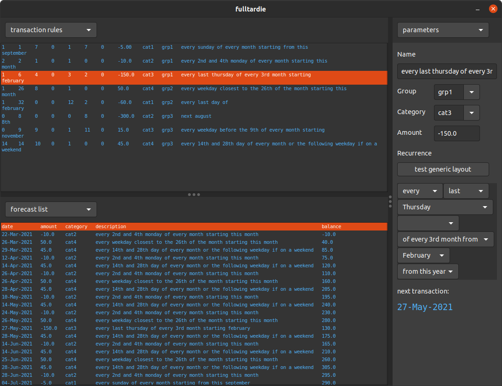

# fulltardie2
- recuring transaction forecaster
- uses complex recurrence rules that should cover most cycles

# todo
- [X] brain-surgery: swap out the data structure
- [ ] automatic plain-English translation of the recurrence rules
- [X] set rule elements by clicking on parts of the English translation
- [X] 3-pane ui
- [X] resize panes with dividers
- [ ] assign views to panes, allowing for duplication, eg: two graphs.
- [X] view panes to have in-situ settings bar
- [ ] update i/o
- [ ] scenario switcher

rule list view
- [ ] rule list header
- [ ] rule list lower space (last-entry fights with the horizontal scrollabr)

selected-rule parameters view
- [X] auto re-arrange wigets to fit panel
- [X] fix any off-by-one errors
- [ ] clarify display of :each nth weekday
- [ ] optimize layout function

forecast list view
- [X] test existing
- [ ] sync selection to rule that generated the entry

graph view
- [ ] re-write it

calendar view (maybe)
- [ ] study existing techniques

raw data view
- [ ] test existing
